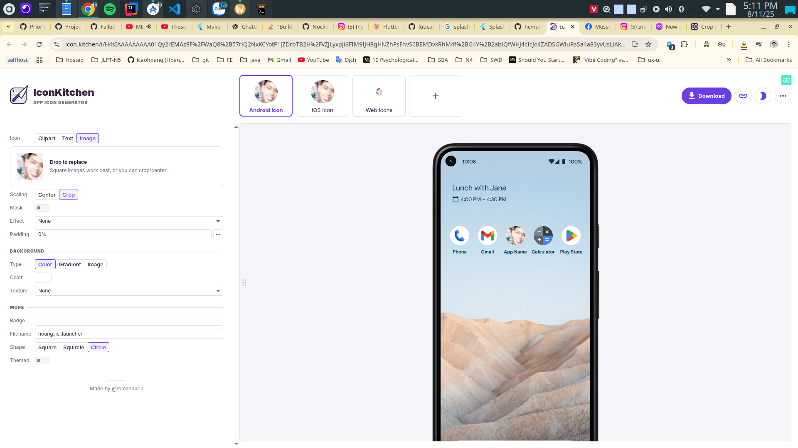

# Splash Screen

- Generate own icon at https://icon.kitchen/



- Copy all inside `Sources/IconKitchen-Output/android/res/` to `app/src/main/res/` (overwrite existing files)
- Change `app/src/main/AndroidManifest.xml` to use the new icon, name is `hoang_ic_launcher`, default is `ic_launcher` and `ic_launcher_round`

```xml
<application
        android:icon="@mipmap/hoang_ic_launcher"
        android:roundIcon="@mipmap/hoang_ic_launcher">
</application>
```

# Environment variables config

- local.properties

```
my.api.key=YOUR_API_KEY
```

- build.gradle.kts: update `defaultConfig` to read from `local.properties` and enable `buildConfig`
  feature

```kotlin
defaultConfig {
    /// Existing configurations...

    // Read from local.properties
    val properties = Properties()
    if (rootProject.file("local.properties").exists()) {
        properties.load(project.rootProject.file("local.properties").inputStream())
    } else {
        throw RuntimeException("local.properties file not found")
    }

    val error = "variable not found in local.properties"

    // Define BuildConfig fields without revealing fallback values
    buildConfigField(
        "String", "YOUR_API_KEY",
        "\"${properties.getProperty("my.api.key") ?: throw RuntimeException(error)}\""
    )
}

buildFeatures {

    // Existing features...

    // Environment variable configuration
    buildConfig = true
}

```
